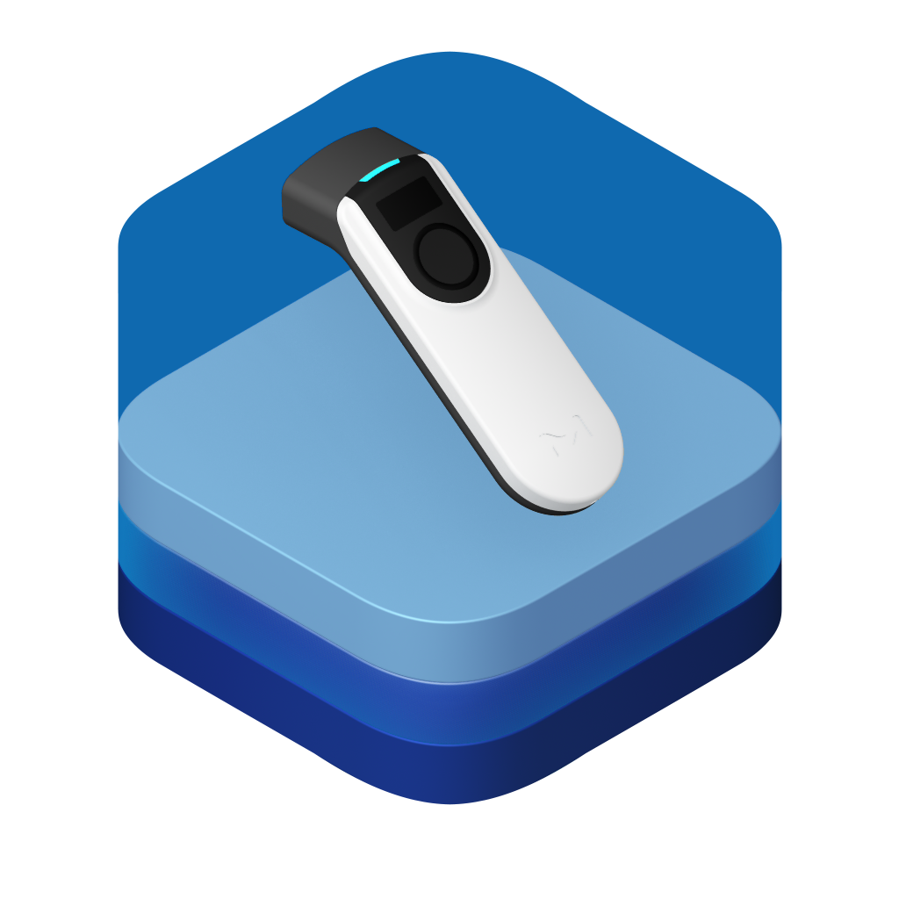

# SEC-Kit



[](https://docs.mtrust.io/sdks/sec-kit/)


[](https://pub.dev/packages/mtrust_sec_kit)
[](https://pub.dev/packages/mtrust_sec_kit/score)
[](https://pub.dev/packages/very_good_analysis)

## Overview

The SEC-Kit simplifies the integration of the M-Trust SEC-Reader into your Flutter application, providing secure and efficient communication capabilities.

## Prerequisites

- Flutter SDK installed on your system.
- Basic knowledge of Flutter development.
- Access to the M-Trust SEC-Reader hardware, or use the `mtrust_virtual_strategy` for development without the hardware.

## Getting started

## Installation

Add the `mtrust_sec_kit` to your Flutter project via the pub add command

```
flutter pub add mtrust_sec_kit
```

SEC-Kit can work with different URP Connection Strategy. The default for SEC Readers is BLE. 
Add the ble connection strategy to your project by including it in your `pubspec.yaml` file.
```
flutter pub add mtrust_urp_ble_strategy
```

Please follow the instructions for configuring BLE for your respective platform in the [README](https://github.com/emdgroup/mtrust-urp/blob/main/mtrust_urp_ble_strategy/README.md) of the `urp_ble_strategy`!

## How to use

### Basic Example

### Localization
To support multiple languages, add the necessary localization delegates to your application. For comprehensive guidance on internationalization, consult the [flutter documentation](https://docs.flutter.dev/ui/accessibility-and-internationalization/internationalization). Please note that you do not need the `LiquidLocalizations.delegate`, `UrpUiLocalizations.delegate` and `SecLocalizations.delegate` if you do not use the SEC Kit's UI components.

```dart
  return const MaterialApp(
    title: 'Your awesome application',
      localizationsDelegates: [
        DefaultMaterialLocalizations.delegate,
        DefaultWidgetsLocalizations.delegate,
        LiquidLocalizations.delegate,
        UrpUiLocalizations.delegate,
        SecLocalizations.delegate,
      ],
      
      home: MyHomePage(),
    );
```

### Adding UI dependencies

To utilize SEC-Kit's UI components, incorporate the following providers and portals:

1. **Theme Provider:** Wrap your app with LdThemeProvider:
    ```dart
    LdThemeProvider(
        child: MaterialApp(
          home: MyHomePage(),
        ),
    )
    ```

2. **Portal:** Enclose your Scaffold with LdPortal:

    ```dart
    LdPortal(
      child: Scaffold(
        ...
      ),
    )
    ```

In case you do not want to use SEC Kit's UI components, you can control the SEC Reader using the `SecReader` class.
For more information please refer to [Use SecReader to build custom workflows](#custom-ui-example-for-ios-10-step-integration)

### Use the SEC Modal 

To display the SEC Modal, utilize the `SecModalBuilder` widget. It requires a connection strategy, a payload, and callbacks for the verification process:


```dart
  SecModalBuilder(
    strategy: _connectionStrategy,
    payload: // Payload,
    onVerificationDone: (mesurement) {},
    onVerificationFailed: (exception) {
      // Handle verification failure. The exception provides details about the cause.
    },
    onDismiss: (){ } // Optionally 
    canDismiss: true, // Define whether the user can dismiss the modal
    builder: (context, openModal) {
      // Call openModal to open the SEC Sheet
    },
  ),

```

### Custom UI Example for iOS (10 step integration)

To build custom workflows, utilize the `SecReader` class. It requires a connection strategy to handle the connection between the device and the reader.

1. Create a new Flutter application:
```bash
flutter create -e my_app
```

2. Install flutter dependencies:
```bash
flutter pub add mtrust_sec_kit mtrust_urp_ble_strategy
```

3. Add permission configuration to the `info.plist` for iOS:
```
  <key>NSBluetoothAlwaysUsageDescription</key>
  <string>This app always needs Bluetooth to function</string>
  <key>NSBluetoothPeripheralUsageDescription</key>
  <string>This app needs Bluetooth Peripheral to function</string>
  <key>NSLocationAlwaysAndWhenInUseUsageDescription</key>
  <string>This app always needs location and when in use to function</string>
  <key>NSLocationAlwaysUsageDescription</key>
  <string>This app always needs location to function</string>
  <key>NSLocationWhenInUseUsageDescription</key>
  <string>This app needs location when in use to function</string>
```

4. Assing a developer team to the iOS solution. Open the `ios` folder in Xcode and assign yourself or your team to the signature of your Runner.

5. Now we are ready to create an instance of a SEC Reader in the code.
```dart
  final reader = SecReader(
    connectionStrategy: _bleStrategy
  );
```

6. As the `SecReader` expects a connection strategy, we also need to create this one:
```dart
  final UrpBleStrategy _bleStrategy = UrpBleStrategy();
```

7. Now we can create `connect` and `disconnect` methods already:
```dart
  Future<void> findAndConnect() async {
    await _bleStrategy.findAndConnectDevice(
      readerTypes: {UrpDeviceType.urpSec},
    );
  }

  Future<void> disconnect() async {
    await _bleStrategy.disconnectDevice();
  }
```

8. Finally we can create a minimal UI to display the buttons. Change your `MainApp` from a `Stateless` to a `Stateful` widget.
```dart
  Center(
    child: ListenableBuilder(
      listenable: _bleStrategy,
      builder: (context, child) {
        return Column(
          mainAxisAlignment: MainAxisAlignment.center,
          crossAxisAlignment: CrossAxisAlignment.center,
          children: [
            Text("Reader: ${reader.connectionStrategy.status}"),
            reader.connectionStrategy.status == ConnectionStatus.connected ? Column(
              children: [
                ElevatedButton(
                  onPressed: disconnect,
                  child: const Text('Disconnect'),
                )
              ],
            ) : ElevatedButton(
              onPressed: findAndConnect,
                child: const Text('Find and Connect'),
              ),
          ],
        );
      }
    ),
  ),
```

9. Great, we are able to connect to our device and disconnect it again. Let's continue with a measurement. Let's add a `measure` method for this:
```dart
  Future<UrpSecMeasurement> measure() async {
    await reader.prime('example payload');
    final measurement = await reader.startMeasurement();
    print(measurement);
    return measurement.measurement;
  }
```

10. And finally add a button to start the measurement:
```dart
  ElevatedButton(
    onPressed: measure,
    child: const Text('Measure'),
  )
```

With the `SecReader` you can access all methods required to build workflows that meet your specific requirements.

## Configuration Options
- **Connection Strategies:** While BLE is the default, SEC-Kit supports various connection strategies. Ensure you include and configure the appropriate strategy package as needed.

## Troubleshooting
- **BLE Connectivity Issues:** Verify that your device's Bluetooth is enabled and that the M-Trust SEC-Reader is powered on and in range.

- **Font Rendering Problems:** Ensure that the font assets are correctly referenced in your `pubspec.yaml` and that the files exist in the specified paths.

## Contributing
We welcome contributions! Please fork the repository and submit a pull request with your changes. Ensure that your code adheres to our coding standards and includes appropriate tests.

## License
This project is licensed under the Apache 2.0 License. See the [LICENSE](./LICENSE) file for details.